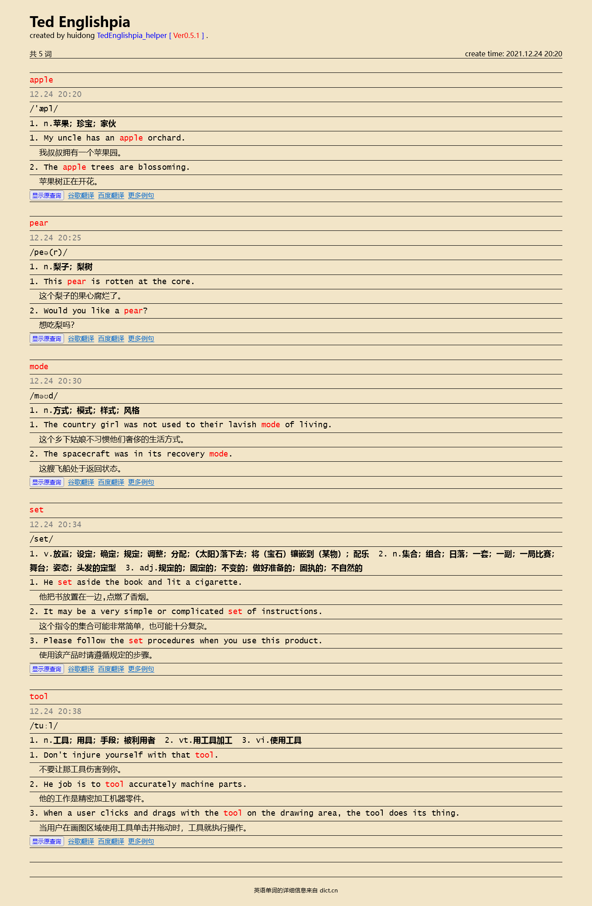
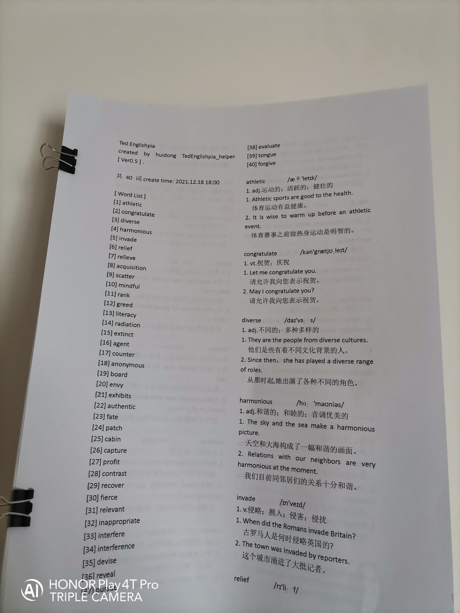

# TedEnglishpia_helper

## Table of Contents

* [TedEnglishpia\_helper](#tedenglishpia_helper)
  * [项目简介](#项目简介)
    * [关于 "Englishpia" 项目名称](#关于-englishpia-项目名称)
    * [编译环境](#编译环境)
  * [凭什么要用这个工具](#凭什么要用这个工具)
  * [运行效果](#运行效果)
  * [操作说明](#操作说明)
  * [实操建议](#实操建议)
  * [打印教程](#打印教程)
  * [更新日志](#更新日志)

## 项目简介

Ted 每日基础作业：查至少 5 个生词，并记录在 Englishpedia（自制英语词典）上。

但是我个人写 pedia 一般是很花时间的，如果平时在学校，需要一个个词查字典，看释义，理解例句，纠结哪个例句、哪个释义适合抄下来……然后抄了半天。

因为太花时间，特写此工具快速生成网页版 Englishpedia。

一条合格的 Englishpedia 词条记录有以下格式要求：

* 记录时间
* 音标
* 释义
* 例句（至少两个，高亮词汇）

此程序通过爬取网络数据，让你只需要输入待查询词汇，就可以自动生成合格的 Englishpedia。

生成的 Englishpedia 以 HTML 网页的形式展示，可以进行打印（详见后文“打印建议”）。

**注意：使用此工具的最高效手段是打印出生成的 pedia，这就要求你必须有打印机，详见后文“实操建议”。**

P.S. 英语单词的详细信息来自 dict.cn

### 关于 "Englishpia" 项目名称

该项目名称是 "TedEnglishpia_helper"

创建项目的时候错把 "Englishpedia" 写成了 "Englishpia"，于是一错再错……

这也可以当做是此工具的特色名称吧~（手动滑稽）

### 编译环境

VisualStudio 2022

Windows 10

## 凭什么要用这个工具

* 如果你嫌累从来不写 pedia，那么用这个工具你可以轻松制作 pedia。

* 如果你有时候写一点 pedia，没时间的时候就不写了，那么这个工具可以节省你大量的时间。

* 如果你有很多单词想抄进 pedia，但是还是因为时间不够只挑了一些抄（就比如你想把两个相似词都抄录下来进行对比，或者是想抄录一个好像不那么重要的单词，但是因为没那么多时间就放弃了），那么用这个工具你不再需要担心花时间的问题，多少单词都行。

总的来说，这个工具可以为你省时省力，更能帮助从来不写 pedia 的人群。

如果你感兴趣，可以继续往下了解。

## 运行效果

**先看看程序效果吧~**

生成的 pedia 文档：

控制台窗口：

## 操作说明

运行程序，在 cmd 中输入要查询的单词，输入每个单词之后都要回车，若输入 `/` 字符后再回车即可开始查询。

更多指令请在程序中输入 `/help` 查看。

## 实操建议

本来这一栏的标题叫 “一些经验”，但是想必也没有人看我啰嗦，索性简单点说说吧。

你可以用本程序生成网页版的 pedia 文档然后对着抄在本子上，或者直接把生成的网页文档打印下来，再装订成册。

然而生成出 pedia 抄在本子上还是很花时间，我自己试了，直接打印出来看和对着抄一遍，记忆的效果都差不多。
抄一遍顶多就是在抄完的几个小时内还有点儿印象，第二天就模糊了，如果打印出来仔细看一遍效果也类似，还不用花大量时间抄，主要还是靠平时复习。

所以我建议，如果使用本工具，可以将生成的 pedia 直接打印出来看，不需要再抄录。

这就要求你必须有一台打印机。

除此之外，唯一的遗憾就是：如果使用此工具，必须每周回家在电脑上才有机会打印 pedia……习惯了其实并不是什么大问题，我每周末都会根据上一周的生词打印一份 30~60 词的 pedia。

如果你想借助此工具打印 pedia，请看下一节 【打印教程】。

## 打印教程

打印效果图：

直接将此工具生成的单词文档打印出来，可以使你做 pedia 的效率提升到最高。但是如果要打印，还需要注意一些事项。

以下是使用此工具打印 TedEnglishpedia 的一个完整流程：

1. 运行程序，在程序中使用 `/mode:print` 指令，将文档模式设置为【打印模式】（设置为简易模式亦可）。

2. 如果单词数量较多，希望生成单词目录，可以使用 `/directory` 指令。

3. 如果单词数量较多，可以将所有单词写在一个 txt 文件中，每个单词以换行隔开，然后在程序中使用 `/file` 指令，在打开的对话框中选择到 txt 文件。
   
   若不使用 `/file` 指令，则直接在 cmd 中输入单词即可，程序将生成 pedia 的网页文档。
   
4. 使用 `Ctrl` + `A` 快捷键全选整个网页文档，然后复制下来，黏贴到一个 Word 文档中，然后，在 Word 界面中选择顶部的【页面布局】->【分栏】->【两栏】。
   
   分两栏的目的是使纸张的利用率提高，你可以尝试一下，如果不分栏的话，50 个单词的 pedia 大约需要 9 面 A4 纸才能打印完，而分栏之后只需要 6 面纸。
   
   P.S. 建议全选 Word 文档，选择 Calibri Light 字体。
   
   这样 pedia 的内容就整合好到 Word 文档中了，可以开始打印了~
   
虽然看起来文字很多，其实这都是因为说的比较详细，动手试试其实很简单的。

复制到 Word 文档中（图）：

## 词源追溯

在程序中使用指令 `/wordsourcing` 可以开启词源追溯，即在指定的单词表中，追溯每个单词在指定的文章中的出处句子。（该功能面向高中英语教材，详见 https://github.com/zouhuidong/WordSourcing ）

## 更新日志

**Ver 0.6.0**（2022.05.01）

1. 更新词源追溯功能（使用指令 `/wordsourcing`）
2. 修复 pedia 文档的一些 bug，打印时不再需要 Chromium 内核的浏览器。

**Ver 0.5.1** (2021.12.24)

上周的更新还是有一些小细节让我不太满意，所以进行了一点小修改。因为更新内容比较少，所以版本号就再加一位小数点吧。

1. 在用户选择生成单词目录的前提下，在每个单词前面加上序号。

2. 更新了 pedia 文档的配色样式，将传统的 “传统白绿色单行本样式” 改为了 “Notebook 现代风格”。（P.S. 用户也可以自行修改 `./res/module/css/` 下的 .css 文件来调整配色样式哦~）

3. 更新了控制台窗口的首页样式，现在变得更整洁了（还有 TED logo 坐镇）。但是经测试，在 Windows 7 下会出现严重的字符错位现象，所以还是 Windows 10 yes 吧~。

**Ver 0.5** (2021.12.18)

距离上次更新已经有将近两个月了。这次更新把这段时间以来发现的不足之处进行了改善，具体如下：

1. 将模版 HTML 网页与 css 结合，用户可以在程序中设置生成的文档页面为【标准模式】或【简易模式】或【打印模式】。

2. 可以选择生成单词目录。如果有大量单词，生成目录可以清晰地概览所有单词（该功能主要是用在打印模式下）。

3. 将项目环境升级到了 VisualStudio 2022，并且调整了项目代码结构，分离了不同的功能模块。

4. 微调了 Englishpia 文档页面。

具体的指令格式请在程序中输入 `/help` 查看。

**Ver 0.4** (2021.10.29)

好久没更新，跨越了一个月，于是根据自己使用中的感受更新了一些内容：

1. 支持打开含有英语单词的 txt 文件，如需要，请使用 `/file` 命令。（文件格式：每个单词后面空一行即可~）

   这样做的原因是：
   
   如果直接在 cmd 中输入大量的待查询单词，如果其中有输入错误的单词就难以改正；
   
   在文件中调整大量待查询单词的拼写，顺序等比较方便。
   
2. 又微调了单词抄录默认耗时和随机偏移量，之前是 6min 的抄录时间，2min 的随机偏移，现在分别改成了 4min 和 1min。

   调整的原因是我觉得可以用这个时间来检验自己抄录的速度是否太慢了，所以就按照我自己大概的抄写速度进行了调整。
   
   
3. 支持直接在单词后面加 `/`，这样就可以直接开始查询，省去了换一行再 `/` 的麻烦。

4. 同样微调了 Englishpia 页面。

**Ver 0.3** (2021.9.19)

1. 修复部分单词获取例句失败的 bug
2. 增强基准时间设置命令的兼容性，增加支持 `/月份.天数` 格式命令
3. 微调单词抄录默认耗时和随机偏移量
4. 微调 Englishpia 页面

**Ver 0.2** (2021.9.19)

1. 例句中的单词使用原句内容
2. 显示单词数量
3. 支持设置基准时间，在程序中输入 `/help` 查看更多。

**Ver 0.1** (2021.9.19)

第一个版本
